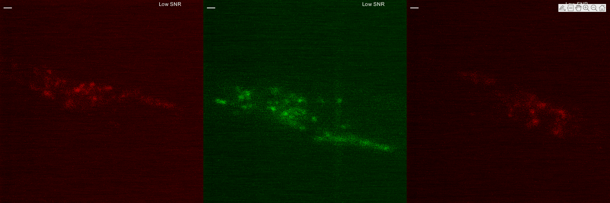
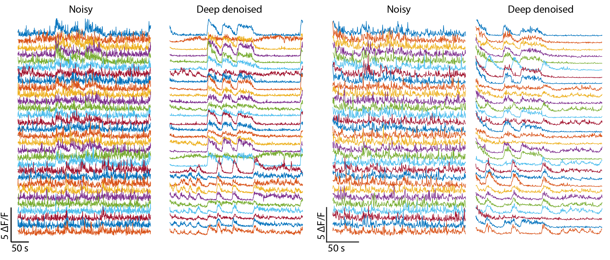

<!--  -->


# whole-brain_DeepDenoising
Deep denoising pushes the limit of functional data acquisition by recovering high SNR calcium traces from low SNR videos acquired using low laser power or smaller exposure time. Thus deep denoising enables faster and longer volumetric recordings. For more details, our  is avalable on biorxiv.

<p align = "center"><b>Denoise whole-brain videos</b></p>


<p align = "center"><b>Denoise mechanosensory neurites</b></p>


<p align = "center"><b>Recover high SNR calcium traces</b></p>


# Contents
1. [Installation](#installation)
2. [Additional system requirements](#additional-system-requirements)
3. [Train on new dataset](#train-on-new-dataset)
4. [Denoise calcium activity recordings](#denoise-calcium-activity-recordings)
5. [Denoise independent images](#denoise-independent-images)
6. [Run sample datasets](#run-sample-datasets)

# Installation
Installation steps tested for Windows 10 64-bit and Python 3.5

### 1. Download whole-brain_DeepDenoising repository
Open Git Bash terminal, navigate to desired location and clone repository using `git clone https://github.com/shiveshc/whole-brain_DeepDenoising.git`.

Or click on `Code` button on top right corner and `Download ZIP`.

### 2. Setting up venv and installing libraries
Open command line terminal as administrator and navigate to cloned repository path using `cd .\whole-brain_DeepDenoising`.

Next run following commands - 
| Windows 10 | MacOS |
|------------|-------|
| 1. `python -m venv env` | 1. `python -m venv env` |
| 2. `env\Scripts\activate.bat` | 2. `source env/bin/activate` |
| 3. `python -m pip install --upgrade "pip < 21.0"` | 3. `python -m pip install --upgrade "pip < 21.0"` |
| 4. `pip install -r requirements.txt` | 4. `pip install -r requirements.txt` |

Installation should take 10-15 minutes.

Common installation errors -
1. pip version is not upgraded\
    __solution :__ upgrade pip using `python -m pip install --upgrade pip`
2. pip version is not compatible with python version\
    __solution :__ install suitable pip version e.g. pip version < 21.0 is compatible with Python 3.5.
    
# Additional system requirements
Model training using GPUs is much faster and thus preferred. To be able to use GPUs, suitable NVIDIA drivers and CUDA libraries must be installed. Additional instructions on setting up tensorflow-gpu can be found at <a href = "https://www.tensorflow.org/install/gpu#Software_requirements">Software requirements</a> and <a href = "https://www.tensorflow.org/install/gpu#windows_setup">Windows setup</a>.

For tensorflow 1.6.0 currently setup in venv, CUDA v9.0 and `cudnn-9.0-windows10-x64-v7.6.4.38` downloaded from <a href= "https://developer.nvidia.com/rdp/cudnn-archive">cudnn archives</a> works for Windows 10 64-bit.

# Train on new dataset
1. To train network on new data, pairs of noisy i.e. low SNR images (acquired at low laser power or small exposure time conditions) and clean i.e. high SNR images (acquired at high laser power or long exposure time conditions) are needed. Currently supported image size is 512 x 512 x d where d is number of images in stack. For other image sizes, either resize images first or channel dimensions need to be changed in architecture files in `cnn_archs` folder.

2. Structure of training data folder should be organised as below -
    ```
    data
    ├───gt_imgs
    │   ├───img_1
    │   │       z_1.tif
    │   │       z_2.tif
    │   │       ...
    │   │
    │   ├───img_2
    │   │       z_1.tif
    │   │       z_2.tif
    │   │       ...
    │   │
    │   └───img_3
    │           z_1.tif
    │           z_2.tif
    │           ...
    │
    └───noisy_imgs
        ├───img_1
        │       z_1.tif
        │       z_2.tif
        │       ...
        │
        ├───img_2
        │       z_1.tif
        │       z_2.tif
        │       ...
        │
        └───img_3
                z_1.tif
                z_2.tif
                ...
     ```
 
 3. Run `python train.py -h` to see usage and input arguments. The output on terminal should look like below -
     ```
    usage: train.py [-h] [-out OUT]
                    [-arch {unet,unet_fixed,hourglass_wres,hourglass_wores}]
                    [-mode {2D,2.5D,3D}] [-depth DEPTH] [-loss {l2,l1}]
                    [-epochs EPOCHS] [-lr LR] [-bs BS] [-tsize TSIZE]
                    data run {1,0}

    train CNN model to denoise volumetric functional recordings

    positional arguments:
      data                  training data path
      run                   run number to distinguish different runs
      {1,0}                 1 if train network on max projection of 3D stacks else
                            0

    optional arguments:
      -h, --help            show this help message and exit
      -out OUT              location for saving results
      -arch {unet,unet_fixed,hourglass_wres,hourglass_wores}
                            CNN architechture to use for training (default is
                            hourglass_wres)
      -mode {2D,2.5D,3D}    training mode (default is 2D)
      -depth DEPTH          stack depth to use for training (must be odd number,
                            default is 1)
      -loss {l2,l1}         L2 or L1 loss for training (default is l1)
      -epochs EPOCHS        number of epochs to train the model for (150-200 is
                            good choice, default is 150)
      -lr LR                learning rate (default is 0.001)
      -bs BS                batch size of training (default is 6)
      -tsize TSIZE          data size (number of images) to use for training
      ```
      e.g. to train the network on whole-brain data with following settings -
      - data path - `/training_data` (path should have forward slashes '/')
      - run number - `1`
      - train on max-projection (e.g. ventral cord or neurite data) - `0`
      - out path - `Results` (path should have forward slashes '/')
      - architecture - `unet_fixed`
      - training mode - `2D`
      - loss - `l1`
      - number of training epochs - `200`
      - batch size - `10`

     run following commands -
     1) `env\Scripts\activate.bat`
     2) `python train.py /training_data 1 0 -out Results -arch unet_fixed -mode 2D -loss l1 -epoch 200 -bs 10`
 
 4. Once training is finished a folder named `run_unet_fixed_l1_mp0_m2D_d1_1_[tsize]` will be created in `Results` folder. Output files in this folder should look like below (e.g. shown for a sample run)
     ```
    Results
    └───run_unet_fixed_l1_mp0_m2D_d1_1_[tsize]
            checkpoint
            events.out.tfevents.1618996150.atl1-1-01-004-33.pace.gatech.edu
            model.data-00000-of-00001
            model.index
            model.meta
            pred_1999.png
            pred_2180.png
            pred_2227.png
            pred_2492.png
            pred_335.png
            test_data_loss.txt
            training_loss.txt
            X_1999.png
            X_2180.png
            X_2227.png
            X_2492.png
            X_335.png
            Y_1999.png
            Y_2180.png
            Y_2227.png
            Y_2492.png
            Y_335.png
     ```
    Here -
    - `training_loss.txt` stores epoch wise loss information on randomly sampled images from training data and test data.
    - `test_data_loss.txt` stores loss on randomly sampled images from test data.
    - `checkpoint`, `events*` and `model*` files will be used to restore trained weights of network to perform inference on new data.
    - `X*.png`, `Y*.png` denote randomly selected noisy (input) and clean (ground-truth) images from test data. `pred*.png` denote corresponding denoised predictions by trained network.


# Denoise calcium activity recordings
1. Structure of functional recording video datasets should be organised as below - 
    ```
    vid1
    └───noisy_imgs
        ├───img_1
        │       z_1.tif
        │       z_2.tif
        │       ...
        │
        ├───img_2
        │       z_1.tif
        │       z_2.tif
        │       ...
        │
        ├───img_3
        │       z_1.tif
        │       z_2.tif
        │       ...
        ...
    ```
    Here `img_1`, `img_2` etc. can correspond to individual time-points in videos.

2. Run `python inference.py -h` to see usage and input arguments. Output on terminal should look like below - 
    ```
    usage: inference.py [-h] data [data ...] run

    denoise images using weights of trained model

    positional arguments:
      data        paths of datasets to be denoised
      run         path of saved trained model

    optional arguments:
      -h, --help  show this help message and exit
    ```

    e.g to denoise two video datasets with following settings - 
    - two video datasets with paths - `/vid1`, `/vid2` (path should have forward slashes '/')
    - save trained network path - `Results/run_unet_fixed_l1_mp0_m2D_d1_1_[tsize]` (path should have forward slashes '/')

    run following commands -
    1) `env\Scripts\activate.bat`
    2) `python inference.py /vid1 /vid2 /Results/run_unet_fixed_l1_mp0_m2D_d1_1_[tsize]`

    __Note :__ to denoise max-projection calcium imaging datasets, folder structure of input dataset should remain same. In this case, use a network trained on max-projection images to denoise e.g. `Results/run_hourglass_wres_l1_mp1_m2D_d1_1_[tsize]` (here mp1 in run name denotes network was trained on max-projection images).

3. Once denoising is finished, output folders `/vid1/pred_run_unet_fixed_l1_mp0_m2D_d1_1_[tsize]` and `/vid2/pred_run_unet_fixed_l1_mp0_m2D_d1_1_[tsize]` will be created. Output files in these folders should look like below -
    ```
    /vid1/pred_run_unet_fixed_l1_mp0_m2D_d1_1_[tsize]
    │   run_unet_fixed_l1_mp0_m2D_d1_1_[tsize]_inference_runtime.txt
    │
    ├───img_1
    │       z_1.tif
    │       z_2.tif
    │       ...
    │
    ├───img_2
    │       z_1.tif
    │       z_2.tif
    │       ...
    │
    ├───img_3
    │       z_1.tif
    │       z_2.tif
    │       ...
    ...
    ```
    Here -
    - `run_unet_fixed_l1_mp0_m2D_d1_1_[tsize]_inference_runtime.txt` stores inference runtime information for each image.
    - `img_1`, `img_2` etc. folders store denoised images corresponding to noisy video.

# Denoise independent images
1. E.g. to denoise 3 individual images (may be 2D images or 3D stacks) with following settings - 
    - 3 images with paths - `data1/img_1.tif`, `data2/img_2.png`, `data2/img_3.png` (path should have forward slashes '/')
    - save trained network path - `Results/run_unet_fixed_l1_mp0_m2D_d1_1_[tsize]` (path should have forward slashes '/')

    run following commands -
    1) `env\Scripts\activate.bat`
    2) `python inference.py data1/img_1.tif data2/img_2.png data2/img_3.png Results/run_unet_fixed_l1_mp0_m2D_d1_1_[tsize]`

2. Once denoising is finished, output folders `data1/pred_run_unet_fixed_l1_mp0_m2D_d1_1_[tsize]_img_1.tif`, `data2/pred_run_unet_fixed_l1_mp0_m2D_d1_1_[tsize]_img_2.png` and `data2/pred_run_unet_fixed_l1_mp0_m2D_d1_1_[tsize]_img_3.png` will be created. Output files in these folders should look like below -
    ```
    data2/pred_run_unet_fixed_l1_mp0_m2D_d1_1_[tsize]_img_2.png
        run_unet_fixed_l1_mp0_m2D_d1_1_[tsize]_inference_runtime.txt
        img_2.png.tif
    ```
    Here -
    - `run_unet_fixed_l1_mp0_m2D_d1_1_[tsize]_inference_runtime.txt` stores inference runtime information for image.
    - `img_2.png.tif` is the denoised output corresponding to `data2/img_2.png`

# Run sample datasets
For demo, we provide three sample datasets, models trained for these datasets, and denoising outputs for these datasets in `sample_runs` folder. These datasets include -
- `Whole_brain` - z-planes from low SNR whole-brain image stacks
- `Mechanosensory` - max-projection images from low SNR stacks of neurites of mechanosensory neurons
- `VentralCord` - max-projection images from low SNR stacks of motor neurons in ventral cord.

Structure of these folders looks like below (shown for `\sample_runs\VentralCord`) - 
```
\sample_runs\VentralCord
│   X_101.png
│   X_109.png
│   X_11.png
│   X_115.png
│   X_118.png
│   X_122.png
│   X_123.png
│   X_26.png
│   X_42.png
│   X_67.png
│   X_76.png
│   X_81.png
│   X_91.png
│   X_92.png
│
├───run_hourglass_wres_l2_mp1_m2D_d1_2_317
│       checkpoint
│       events.out.tfevents.1625789062.atl1-1-02-006-35.pace.gatech.edu
│       model.data-00000-of-00001
│       model.index
│       model.meta
│       test_data_loss.txt
│       training_loss.txt
│
└───sample_output
    ├───pred_run_hourglass_wres_l2_mp1_m2D_d1_2_317_X_101.png
    │       run_hourglass_wres_l2_mp1_m2D_d1_2_317_inference_runtime.txt
    │       X_101.png.tif
    │
    ├───pred_run_hourglass_wres_l2_mp1_m2D_d1_2_317_X_11.png
    │       run_hourglass_wres_l2_mp1_m2D_d1_2_317_inference_runtime.txt
    │       X_11.png.tif
    │
    ├───pred_run_hourglass_wres_l2_mp1_m2D_d1_2_317_X_122.png
    │       run_hourglass_wres_l2_mp1_m2D_d1_2_317_inference_runtime.txt
    │       X_122.png.tif
    │
    ├───pred_run_hourglass_wres_l2_mp1_m2D_d1_2_317_X_42.png
    │       run_hourglass_wres_l2_mp1_m2D_d1_2_317_inference_runtime.txt
    │       X_42.png.tif
    │
    ├───pred_run_hourglass_wres_l2_mp1_m2D_d1_2_317_X_81.png
    │       run_hourglass_wres_l2_mp1_m2D_d1_2_317_inference_runtime.txt
    │       X_81.png.tif
    │
    ├───pred_run_hourglass_wres_l2_mp1_m2D_d1_2_317_X_91.png
    │       run_hourglass_wres_l2_mp1_m2D_d1_2_317_inference_runtime.txt
    │       X_91.png.tif
    │
    └───pred_run_hourglass_wres_l2_mp1_m2D_d1_2_317_X_92.png
            run_hourglass_wres_l2_mp1_m2D_d1_2_317_inference_runtime.txt
            X_92.png.tif
```
Here -
- `X_*.png` correspond to low SNR images.
- `run_hourglass_wres_l2_mp1_m2D_d1_2_317` stores `hourglass_wres` cnn trained on max-projection images (`mp1`) from ventral cord dataset in `2D` mode using `l2` loss function. The stored model can be used to denoise images.
- `sample_output\pred_*` folders store denoised outputs of trained cnn for corresponding `X_*.png` images.

To denoise an example image, run following commands -
1) `env\Scripts\activate.bat`
2) `python inference.py sample_runs/VentralCord/X_26.png sample_runs/VentralCord/run_hourglass_wres_l2_mp1_m2D_d1_2_317`

Upon completion, a new folder, `pred_run_hourglass_wres_l2_mp1_m2D_d1_2_317_X_26.png`, will be created in the same directory that contains denoised output. The folder structure should like below now -
```
\sample_runs\VentralCord
│   X_101.png
│   X_109.png
│   X_11.png
│   X_115.png
│   X_118.png
│   X_122.png
│   X_123.png
│   X_26.png
│   X_42.png
│   X_67.png
│   X_76.png
│   X_81.png
│   X_91.png
│   X_92.png
│
├───pred_run_hourglass_wres_l2_mp1_m2D_d1_2_317_X_26.png
│       run_hourglass_wres_l2_mp1_m2D_d1_2_317_inference_runtime.txt
│       X_26.png.tif
│
├───run_hourglass_wres_l2_mp1_m2D_d1_2_317
│       checkpoint
│       events.out.tfevents.1625789062.atl1-1-02-006-35.pace.gatech.edu
│       model.data-00000-of-00001
│       model.index
│       model.meta
│       test_data_loss.txt
│       training_loss.txt
│
└───sample_output
```
